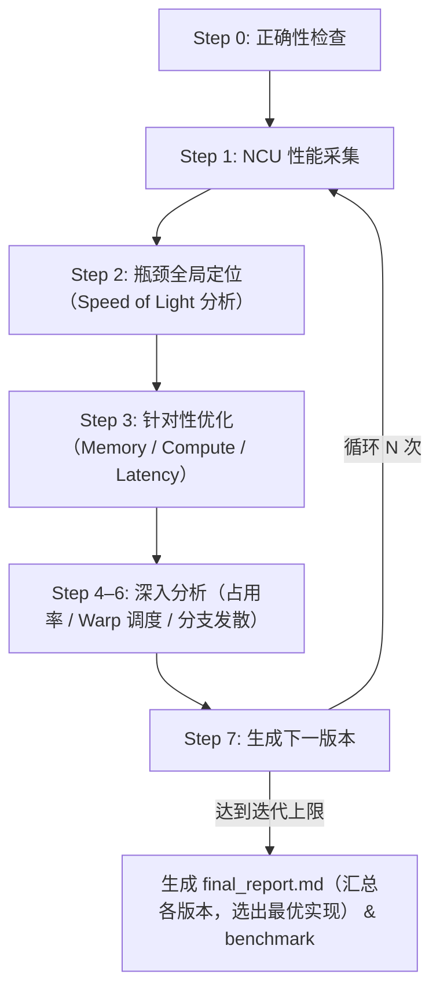

# kernel-opt-skill

面向 CUDA 的 kernel 优化 Skill，通过系统化的性能分析、瓶颈定位和迭代优化，帮助开发者快速提升 CUDA kernel 性能。

[English](README.md)

## 环境要求

| 依赖项 | 版本要求 |
| --- | --- |
| NVIDIA GPU | Compute Capability 7.0+（Volta 及以上） |
| CUDA Toolkit | 11.6+（推荐 12.6+） |
| Nsight Compute | 2024.3.2+ |
| Python | 3.10+ |
| PyTorch | 2.0+ |
| nsight-python | 0.9.6+ |

## 项目结构

```text
kernel-opt-skill/
├── skills/kernel-opt-skill/
│   ├── SKILL.md                  # 主入口，定义优化流程
│   ├── env/                      # 环境检查与 GPU 配置
│   ├── profiling/                # NCU 性能分析与正确性验证
│   ├── benchmark/                # solution 与 reference 框架横向对比
│   ├── cuda/                     # 内存/计算/延迟优化策略参考
│   └── report/                   # 报告生成模板
└── demo/                         # 优化实战案例（softmax、gemm……）
```

## 快速开始

调用 Skill，指定待优化的 kernel 文件、迭代次数和输出目录：

```text
/kernel-opt-skill 请帮我优化这个 kernel <kernel.cu>，迭代三次，输出到 <output_dir> 目录
```

触发后，将按以下步骤自动执行优化循环：



### 输出目录结构

```text
<output_dir>/
├── ref.py                  # 参考实现
├── env_check.md            # 环境信息
├── v0/
│   ├── v0.cu               # 源码
│   ├── correctness.md      # 正确性验证结果
│   ├── ncu_summary.md      # NCU 指标摘要（LLM 友好格式）
│   └── ncu_details.md      # NCU 完整指标表格
├── v1/ v2/ v3/ ...         # 各迭代版本（结构同上）
├── final_report.md         # 最终优化对比报告
└── benchmark.md            # 最优版本与 reference 的性能横向对比
```

## Benchmark 对比

优化循环结束后，benchmark-skill 自动将 **best version** 与 **reference implementation（PyTorch / CUTLASS）** 进行横向性能对比：

| 维度 | 方式 | 说明 |
| --- | --- | --- |
| Execution Time | CUDA Events（100 次迭代） | 真实 wall-clock latency，不受 nsight replay 干扰 |
| SM Throughput / Memory Throughput | nsight-python | 硬件利用率 vs peak |
| DRAM Bandwidth | nsight-python | 实际 Memory Bandwidth 绝对值 |
| Achieved Occupancy | nsight-python | Active warp 占比，反映并行度 |

结果写入 `<output_dir>/benchmark.md`。

## 实战案例

### Softmax 优化

参见 [demo/softmax/](demo/softmax/) 目录，完整记录了从基线到最优版本的 4 轮迭代过程。

| 版本 | Execution Time | Speedup | Bottleneck | 关键优化 |
| --- | --- | --- | --- | --- |
| v0（基线） | 891,936 ns | 1.00× | Latency-Bound | 朴素实现（1 thread/行） |
| v1 | **124,896 ns** | **7.14×** | Memory-Bound | 1 block/行 + Warp Shuffle |
| v2 | 131,424 ns | 6.79× | Memory-Bound | Online Softmax + float4（L1 reuse 失效，性能下降） |
| v3 | 127,808 ns | 6.98× | Memory-Bound | 3-pass + float4 + `__expf__`（ILP 下降，性能下降） |

**v1 关键改进（最优版本）：**

- Block 分配策略从 1 thread/行改为 1 block/行，Block 数 40 → 10,240，Achieved Occupancy 16.6% → 94.8%
- Global Load Efficiency 从 12.5% 提升至 100%（coalesced access），DRAM Bandwidth 235 → 673 GB/s
- 使用 Warp Shuffle reduce，仅需 32 字节 Shared Memory 即可完成 max/sum broadcast，无需全局 atomic 操作
- `__ldg` / `__restrict__` read-only cache hint，减少 L2 访问压力

**Benchmark：v1 vs PyTorch reference（N=10240, D=1024）**

| Metric | v1（最优） | PyTorch reference |
| --- | --- | --- |
| Execution Time | **0.1465 ms** | 0.2657 ms |
| SM Throughput | 33.3% | 32.8% |
| Memory Throughput | 91.6% | 91.8% |
| DRAM Bandwidth | 668 GB/s | 669 GB/s |
| Achieved Occupancy | 93.0% | 93.2% |

v1 Execution Time 比 PyTorch 快 **1.81×**，硬件利用率几乎持平——说明两者已同等充分利用 Memory Bandwidth，性能差距来自 PyTorch 的 dispatch overhead 而非 kernel 本身的效率差异。

### GEMM 优化

参见 [demo/gemm/](demo/gemm/) 目录，完整记录了从基线到最优版本的 3 轮迭代过程。

| 版本 | Execution Time | Speedup | Bottleneck | 关键优化 |
| --- | --- | --- | --- | --- |
| v0（基线） | 64.23 ms | 1.00× | Latency-Bound | 朴素实现（non-coalesced access，无共享内存） |
| v1 | 47.88 ms | 1.34× | Latency-Bound | Shared Memory Tiling（32×32） |
| v2 | 11.64 ms | 5.52× | Balanced | 2D 寄存器分块（每线程 4×4，64×64 tile，BK=8） |
| v3 | **9.43 ms** | **6.81×** | Balanced | BK 加倍 + TM=8 + smem padding + float4 store |

**v3 关键改进（最优版本）：**

- K-tile 加倍（BK: 8→16），每轮 tile 计算量翻倍（BK×TM×TN = 16×8×4 = 512 FMA），__syncthreads() 频率减半
- 线程 tile 加深（TM: 4→8），寄存器级数据复用增强，IPC 0.52 → 0.72，Issue Slot 52% → 72%
- 共享内存 padding（`sA[BK][BM+1]`），奇数列步长打破 stride-TM bank conflict，L1 Bank Conflicts 降低 5×
- Float4 向量化 C 写出，Global Store Efficiency 25% → 100%
- FMA Pipe Utilization 38.58% → 55.81%，所有 stall 指标大幅下降（Long SB: 3.01→0.88，Short SB: 2.97→0.15，Barrier: 1.99→0.43）
- 代价：每线程 122 个 register，Achieved Occupancy 从 65.25% 降至 32.69%

**Benchmark：v3 vs PyTorch reference（M=K=N=4096）**

| Metric | v3（最优） | PyTorch reference |
| --- | --- | --- |
| Execution Time | 9.41 ms | **6.18 ms** |
| SM Throughput | 72.6% | 72.5% |
| Memory Throughput | 74.0% | 74.3% |
| DRAM Bandwidth | 539 GB/s | 541 GB/s |
| Achieved Occupancy | 32.7% | 32.7% |

v3 与 PyTorch（cuBLAS）Execution Time 相差约 **1.52×**，硬件利用率几乎完全一致——差距不在 kernel 效率，而在 cuBLAS 更精细的 ILP 和指令调度策略上。
