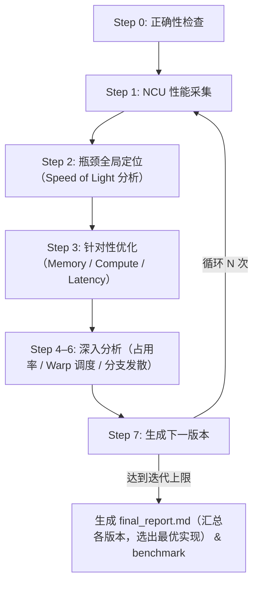

# kernel-opt-skill

面向 CUDA/Triton 的 kernel 优化 Skill，通过系统化的性能分析、瓶颈定位和迭代优化，帮助开发者快速提升 kernel 性能。

[English](README.md)

## 环境要求

| 依赖项 | 版本要求 |
| --- | --- |
| NVIDIA GPU | Compute Capability 7.0+（Volta 及以上） |
| CUDA Toolkit | 11.6+（推荐 12.6+） |
| Nsight Compute | 2024.3.2+ |
| Python | 3.10+ |
| PyTorch | 2.0+ |
| nsight-python | 0.9.6+ |
| Triton | 2.0+ |

## 项目结构

```text
kernel-opt-skill/
├── skills/kernel-opt-skill/
│   ├── SKILL.md                  # 主入口，定义优化流程
│   ├── env/                      # 环境检查与 GPU 配置
│   ├── profiling/                # NCU 性能分析与正确性验证
│   ├── benchmark/                # solution 与 reference 框架横向对比
│   ├── cuda/                     # 内存/计算/延迟优化策略参考
│   ├── triton/                   # Triton 优化策略参考
│   └── report/                   # 报告生成模板
└── demo/                         # 优化实战案例（softmax、gemm……）
```

## 快速开始

调用 Skill，指定待优化的 kernel 文件、迭代次数和输出目录：

```text
/kernel-opt-skill 请帮我优化这个 kernel <kernel.cu>，迭代三次，输出到 <output_dir> 目录
```

### CUDA / Triton 最小模板示例

#### CUDA（`.cu`）

> 说明：profiling 脚本会加载同名动态库并调用 `extern "C" void solve(...)`。

```cpp
#include <cuda_runtime.h>

__global__ void kernel(
    const float* in0, const float* in1, float* out, int n) {
    int i = blockIdx.x * blockDim.x + threadIdx.x;
    if (i < n) {
        // TODO: replace with your kernel logic
        out[i] = in0[i] + in1[i];
    }
}

extern "C" void solve(
    float* in0, float* in1, float* out, int n) {
    int threads = 256;
    int blocks = (n + threads - 1) / threads;
    kernel<<<blocks, threads>>>(in0, in1, out, n);
    cudaDeviceSynchronize();
}
```

#### Triton（`.py`）

> 说明：profiling 脚本要求定义 `setup(**kwargs)` 与 `run_kernel(**kwargs)`。

```python
import torch
import triton
import triton.language as tl

@triton.jit
def _kernel(
    x_ptr, y_ptr, out_ptr, n,
    BLOCK: tl.constexpr,
):
    pid = tl.program_id(axis=0)
    offs = pid * BLOCK + tl.arange(0, BLOCK)
    mask = offs < n
    x = tl.load(x_ptr + offs, mask=mask, other=0.0)
    y = tl.load(y_ptr + offs, mask=mask, other=0.0)
    tl.store(out_ptr + offs, x + y, mask=mask)

def setup(n=1024, seed=42, **kwargs):
    torch.manual_seed(seed)
    x = torch.randn((n,), device="cuda", dtype=torch.float32)
    y = torch.randn((n,), device="cuda", dtype=torch.float32)
    out = torch.empty((n,), device="cuda", dtype=torch.float32)
    return {
        "inputs": {"x": x, "y": y, "out": out, "n": n},
        "outputs": ["out"],
    }

def run_kernel(**kwargs):
    x, y, out = kwargs["x"], kwargs["y"], kwargs["out"]
    n = int(kwargs["n"])
    grid = lambda meta: (triton.cdiv(n, meta["BLOCK"]),)
    _kernel[grid](x, y, out, n, BLOCK=256)
```

#### Reference（`ref.py`）

> 说明：correctness/benchmark 会调用 `reference(**kwargs)` 作为基准实现。

```python
import torch

def reference(**kwargs):
    x = kwargs["x"]
    y = kwargs["y"]
    out = kwargs["out"]
    out.copy_(x + y)
```

触发后，将按以下步骤自动执行优化循环：



### 输出目录结构

```text
<output_dir>/
├── ref.py                  # 参考实现
├── env_check.md            # 环境信息
├── v0/
│   ├── v0.cu / v0.py       # 源码（CUDA / Triton）
│   ├── correctness.md      # 正确性验证结果
│   ├── ncu_summary.md      # NCU 指标摘要（LLM 友好格式）
│   └── ncu_details.md      # NCU 完整指标表格
├── v1/ v2/ v3/ ...         # 各迭代版本（结构同上）
├── final_report.md         # 最终优化对比报告
└── benchmark.md            # 最优版本与 reference 的性能横向对比
```

## 实战案例

完整的优化过程（源码、NCU 指标、每轮决策分析、Benchmark）见 [demo/DEMO.md](demo/DEMO.md)。

| 案例 | 规模 | 最终 Speedup | 最优版本 vs PyTorch |
| --- | --- | --- | --- |
| [Softmax (CUDA)](demo/DEMO.md#softmax) | N=10240, D=1024 | **6.32×** | 1.85× 快于 PyTorch |
| [GEMM (CUDA)](demo/DEMO.md#gemm) | M=K=N=4096 | **6.81×** | 1.52× 慢于 cuBLAS |
| [MHA (CUDA)](demo/DEMO.md#mha) | N=1024, d=512, h=8 | **10.23×** | 2.86× 慢于 Flash Attention |
| [GEMM (Triton)](demo/DEMO.md#gemm-1) | M=N=K=10240 | **3.07×** | 2.28× 快于 torch.mm |
| [MHA (Triton)](demo/DEMO.md#mha-1) | N=1024, d=1024, h=16 | **626×** | 4.12× 快于 PyTorch ref |
| [Softmax (Triton)](demo/DEMO.md#softmax-1) | N=10240, D=1024 | 1.00× (v0 已最优) | 1.79× 快于 PyTorch |
