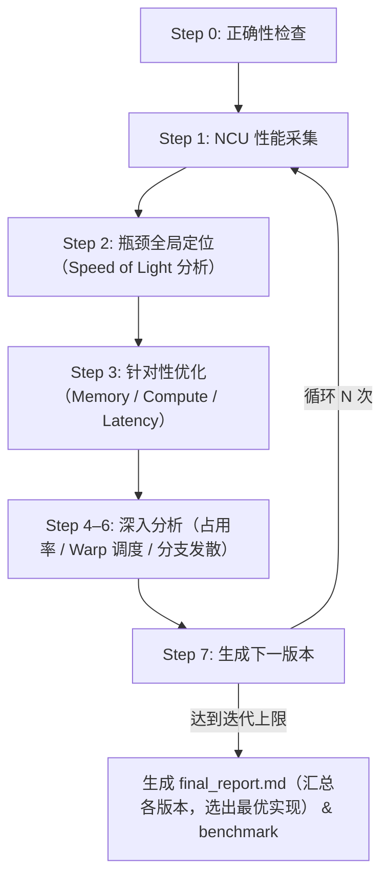

# kernel-opt-skill

面向 CUDA 的 kernel 优化 Skill，通过系统化的性能分析、瓶颈定位和迭代优化，帮助开发者快速提升 CUDA kernel 性能。

[English](README.md)

## 环境要求

| 依赖项 | 版本要求 |
| --- | --- |
| NVIDIA GPU | Compute Capability 7.0+（Volta 及以上） |
| CUDA Toolkit | 11.6+（推荐 12.6+） |
| Nsight Compute | 2024.3.2+ |
| Python | 3.10+ |
| PyTorch | 2.0+ |
| nsight-python | 0.9.6+ |

## 项目结构

```text
kernel-opt-skill/
├── skills/kernel-opt-skill/
│   ├── SKILL.md                  # 主入口，定义优化流程
│   ├── env/                      # 环境检查与 GPU 配置
│   ├── profiling/                # NCU 性能分析与正确性验证
│   ├── benchmark/                # solution 与 reference 框架横向对比
│   ├── cuda/                     # 内存/计算/延迟优化策略参考
│   └── report/                   # 报告生成模板
└── demo/                         # 优化实战案例（softmax、gemm……）
```

## 快速开始

调用 Skill，指定待优化的 kernel 文件、迭代次数和输出目录：

```text
/kernel-opt-skill 请帮我优化这个 kernel <kernel.cu>，迭代三次，输出到 <output_dir> 目录
```

触发后，将按以下步骤自动执行优化循环：



### 输出目录结构

```text
<output_dir>/
├── ref.py                  # 参考实现
├── env_check.md            # 环境信息
├── v0/
│   ├── v0.cu               # 源码
│   ├── correctness.md      # 正确性验证结果
│   ├── ncu_summary.md      # NCU 指标摘要（LLM 友好格式）
│   └── ncu_details.md      # NCU 完整指标表格
├── v1/ v2/ v3/ ...         # 各迭代版本（结构同上）
├── final_report.md         # 最终优化对比报告
└── benchmark.md            # 最优版本与 reference 的性能横向对比
```

## 实战案例

完整的优化过程（源码、NCU 指标、每轮决策分析、Benchmark）见 [demo/DEMO.md](demo/DEMO.md)。

| 案例 | 规模 | 最终 Speedup | 最优版本 vs PyTorch |
| --- | --- | --- | --- |
| [Softmax](demo/DEMO.md#1-softmax) | N=10240, D=1024 | **6.32×** | 1.85× 快于 PyTorch |
| [GEMM](demo/DEMO.md#2-gemm) | M=K=N=4096 | **6.81×** | 1.52× 慢于 cuBLAS |
| [MHA](demo/DEMO.md#3-mha) | N=1024, d=512, h=8 | **10.23×** | 2.86× 慢于 Flash Attention |
