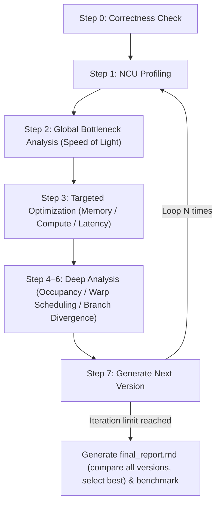

# kernel-opt-skill

A CUDA kernel optimization skill that systematically profiles, identifies bottlenecks, and iteratively improves kernel performance.

[中文文档](README-zh.md)

## Requirements

| Dependency | Version |
| --- | --- |
| NVIDIA GPU | Compute Capability 7.0+ (Volta and above) |
| CUDA Toolkit | 11.6+ (12.6+ recommended) |
| Nsight Compute | 2024.3.2+ |
| Python | 3.10+ |
| PyTorch | 2.0+ |
| nsight-python | 0.9.6+ |

## Project Structure

```text
kernel-opt-skill/
├── skills/kernel-opt-skill/
│   ├── SKILL.md                  # Entry point, defines the optimization loop
│   ├── env/                      # Environment check & GPU configuration
│   ├── profiling/                # NCU profiling & correctness verification
│   ├── benchmark/                # Solution vs reference framework comparison
│   ├── cuda/                     # Memory / compute / latency optimization references
│   └── report/                   # Report generation templates
└── demo/                         # Optimization case studies (softmax, gemm, ...)
```

## Quick Start

Invoke the skill with your kernel file, iteration count, and output directory:

```text
/kernel-opt-skill Please optimize this kernel <kernel.cu>, run 3 iterations, output to <output_dir>
```

The optimization loop runs automatically:



### Output Structure

```text
<output_dir>/
├── ref.py                  # Reference implementation
├── env_check.md            # Environment info
├── v0/
│   ├── v0.cu               # Source code
│   ├── correctness.md      # Correctness verification result
│   ├── ncu_summary.md      # NCU metrics summary (LLM-friendly)
│   └── ncu_details.md      # Full NCU metrics table
├── v1/ v2/ v3/ ...         # Subsequent iterations (same structure)
├── final_report.md         # Final optimization comparison report
└── benchmark.md            # Best version vs reference performance comparison
```

## Demo

### Softmax Optimization

See [demo/softmax/](demo/softmax/) for a complete 4-iteration walkthrough from baseline to best version.

| Version | Latency | Speedup | Bottleneck | Key Optimization |
| --- | --- | --- | --- | --- |
| v0 (baseline) | 891,936 ns | 1.00× | Latency-Bound | Naive (1 thread/row) |
| v1 | **124,896 ns** | **7.14×** | Memory-Bound | 1 block/row + Warp Shuffle |
| v2 | 131,424 ns | 6.79× | Memory-Bound | Online Softmax + float4 (L1 reuse lost, perf regression) |
| v3 | 127,808 ns | 6.98× | Memory-Bound | 3-pass + float4 + __expf__ (ILP drop, perf regression) |

**v1 key improvements (best version):**

- Switched from 1 thread/row to 1 block/row — 40 → 10,240 blocks; occupancy 16.6% → 94.8%
- Global load efficiency 12.5% → 100% (coalesced access); DRAM throughput 235 → 673 GB/s
- Warp shuffle reduction eliminates global atomics with only 32 bytes of shared memory
- `__ldg` / `__restrict__` read-only cache hints reduce L2 pressure

**Benchmark: v1 vs PyTorch reference (N=10240, D=1024)**

| Metric | v1 (best) | PyTorch reference |
| --- | --- | --- |
| Execution time | **0.1465 ms** | 0.2657 ms |
| SM Throughput | 33.3% | 32.8% |
| Memory Throughput | 91.6% | 91.8% |
| DRAM Bandwidth | 668 GB/s | 669 GB/s |
| Achieved Occupancy | 93.0% | 93.2% |

v1 is **1.81× faster** than PyTorch with near-identical hardware utilization — both fully saturate memory bandwidth; the gap comes from PyTorch dispatch overhead rather than kernel efficiency.

### GEMM Optimization

See [demo/gemm/](demo/gemm/) for a complete 4-iteration walkthrough from baseline to best version.

| Version | Latency | Speedup | Bottleneck | Key Optimization |
| --- | --- | --- | --- | --- |
| v0 (baseline) | 62.00 ms | 1.00× | Compute-Bound | Naive (non-coalesced loads) |
| v1 | 44.80 ms | 1.38× | Compute-Bound | Shared Memory Tiling (16×16) |
| v2 | 8.75 ms | 7.09× | Balanced | Register Blocking (4×4 per thread, 64×64 tile) |
| v3 | **6.28 ms** | **9.87×** | Memory-Bound | WMMA Tensor Cores (FP16→FP32) |

**v3 key improvements (best version):**

- WMMA Tensor Core pipeline activated (13.6% utilization); FP16→FP32 fragments unlock 310 TFLOPS theoretical throughput
- v2 register blocking raised FMA pipe utilization 10.6% → 47.8% (256 FMAs/tile vs 16) — foundation for v3
- Global load efficiency maintained at 100% across v1–v3 (coalesced tiled access)
- Trade-off: FP16 inputs introduce precision loss (max error 0.101); occupancy drops to 32.7% due to 118 registers/thread

**Benchmark: v3 vs cuBLAS reference (M=K=N=4096)**

| Metric | v3 (best) | cuBLAS reference |
| --- | --- | --- |
| Execution time | 6.75 ms | **6.08 ms** |
| SM Throughput | 31.8% | 31.8% |
| Memory Throughput | 45.5% | 46.3% |
| DRAM Bandwidth | 331 GB/s | 338 GB/s |
| Achieved Occupancy | 32.7% | 32.7% |

v3 is within **11% of cuBLAS** with virtually identical hardware utilization — the gap is not in kernel efficiency but in cuBLAS's more refined register and warp scheduling.
