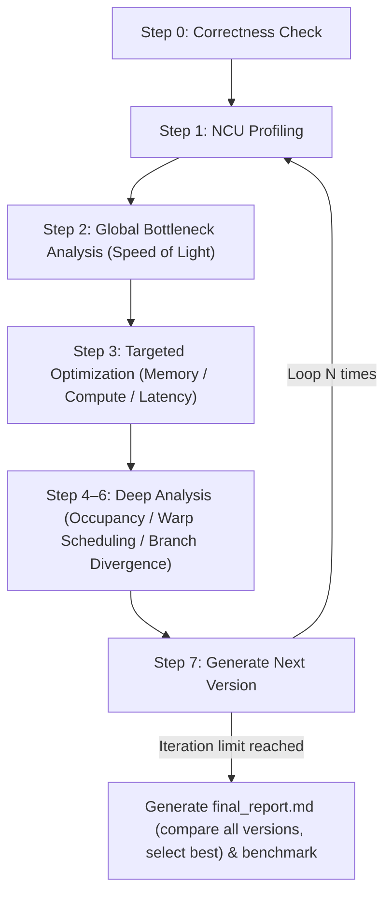

# kernel-opt-skill

A CUDA/Triton kernel optimization skill that systematically profiles, identifies bottlenecks, and iteratively improves kernel performance.

[中文文档](README-zh.md)

## Requirements

| Dependency | Version |
| --- | --- |
| NVIDIA GPU | Compute Capability 7.0+ (Volta and above) |
| CUDA Toolkit | 11.6+ (12.6+ recommended) |
| Nsight Compute | 2024.3.2+ |
| Python | 3.10+ |
| PyTorch | 2.0+ |
| nsight-python | 0.9.6+ |
| Triton | 2.0+ |

## Project Structure

```text
kernel-opt-skill/
├── skills/kernel-opt-skill/
│   ├── SKILL.md                  # Entry point, defines the optimization loop
│   ├── env/                      # Environment check & GPU configuration
│   ├── profiling/                # NCU profiling & correctness verification
│   ├── benchmark/                # Solution vs reference framework comparison
│   ├── cuda/                     # Memory / compute / latency optimization references
│   ├── triton/                   # Triton optimization references
│   └── report/                   # Report generation templates
└── demo/                         # Optimization case studies (softmax, gemm, ...)
```

## Quick Start

Invoke the skill with your kernel file, iteration count, and output directory:

```text
/kernel-opt-skill Please optimize this kernel <kernel.cu>, run 3 iterations, output to <output_dir>
```

### Minimal CUDA / Triton Templates

#### CUDA (`.cu`)

> Note: profiling scripts load the matching shared library and call `extern "C" void solve(...)`.

```cpp
#include <cuda_runtime.h>

__global__ void kernel(
    const float* in0, const float* in1, float* out, int n) {
    int i = blockIdx.x * blockDim.x + threadIdx.x;
    if (i < n) {
        // TODO: replace with your kernel logic
        out[i] = in0[i] + in1[i];
    }
}

extern "C" void solve(
    float* in0, float* in1, float* out, int n) {
    int threads = 256;
    int blocks = (n + threads - 1) / threads;
    kernel<<<blocks, threads>>>(in0, in1, out, n);
    cudaDeviceSynchronize();
}
```

#### Triton (`.py`)

> Note: profiling scripts require both `setup(**kwargs)` and `run_kernel(**kwargs)`.

```python
import torch
import triton
import triton.language as tl

@triton.jit
def _kernel(
    x_ptr, y_ptr, out_ptr, n,
    BLOCK: tl.constexpr,
):
    pid = tl.program_id(axis=0)
    offs = pid * BLOCK + tl.arange(0, BLOCK)
    mask = offs < n
    x = tl.load(x_ptr + offs, mask=mask, other=0.0)
    y = tl.load(y_ptr + offs, mask=mask, other=0.0)
    tl.store(out_ptr + offs, x + y, mask=mask)

def setup(n=1024, seed=42, **kwargs):
    torch.manual_seed(seed)
    x = torch.randn((n,), device="cuda", dtype=torch.float32)
    y = torch.randn((n,), device="cuda", dtype=torch.float32)
    out = torch.empty((n,), device="cuda", dtype=torch.float32)
    return {
        "inputs": {"x": x, "y": y, "out": out, "n": n},
        "outputs": ["out"],
    }

def run_kernel(**kwargs):
    x, y, out = kwargs["x"], kwargs["y"], kwargs["out"]
    n = int(kwargs["n"])
    grid = lambda meta: (triton.cdiv(n, meta["BLOCK"]),)
    _kernel[grid](x, y, out, n, BLOCK=256)
```

#### Reference (`ref.py`)

> Note: correctness/benchmark calls `reference(**kwargs)` as the baseline implementation.

```python
import torch

def reference(**kwargs):
    x = kwargs["x"]
    y = kwargs["y"]
    out = kwargs["out"]
    out.copy_(x + y)
```

The optimization loop runs automatically:



### Output Structure

```text
<output_dir>/
├── ref.py                  # Reference implementation
├── env_check.md            # Environment info
├── v0/
│   ├── v0.cu / v0.py       # Source code (CUDA / Triton)
│   ├── correctness.md      # Correctness verification result
│   ├── ncu_summary.md      # NCU metrics summary (LLM-friendly)
│   └── ncu_details.md      # Full NCU metrics table
├── v1/ v2/ v3/ ...         # Subsequent iterations (same structure)
├── final_report.md         # Final optimization comparison report
└── benchmark.md            # Best version vs reference performance comparison
```

## Case Studies

Full optimization walkthroughs (source code, NCU metrics, per-iteration analysis, benchmarks) are in [demo/DEMO.md](demo/DEMO.md).

| Case | Shape | Final Speedup | Best Version vs PyTorch |
| --- | --- | --- | --- |
| [Softmax (CUDA)](demo/DEMO.md#softmax) | N=10240, D=1024 | **6.32×** | 1.85× faster than PyTorch |
| [GEMM (CUDA)](demo/DEMO.md#gemm) | M=K=N=4096 | **6.81×** | 1.52× slower than cuBLAS |
| [MHA (CUDA)](demo/DEMO.md#mha) | N=1024, d=512, h=8 | **10.23×** | 2.86× slower than Flash Attention |
| [GEMM (Triton)](demo/DEMO.md#gemm-1) | M=N=K=10240 | **3.07×** | 2.28× faster than torch.mm |
| [MHA (Triton)](demo/DEMO.md#mha-1) | N=1024, d=1024, h=16 | **626×** | 4.12× faster than PyTorch ref |
| [Softmax (Triton)](demo/DEMO.md#softmax-1) | N=10240, D=1024 | 1.00× (v0 already optimal) | 1.79× faster than PyTorch |
