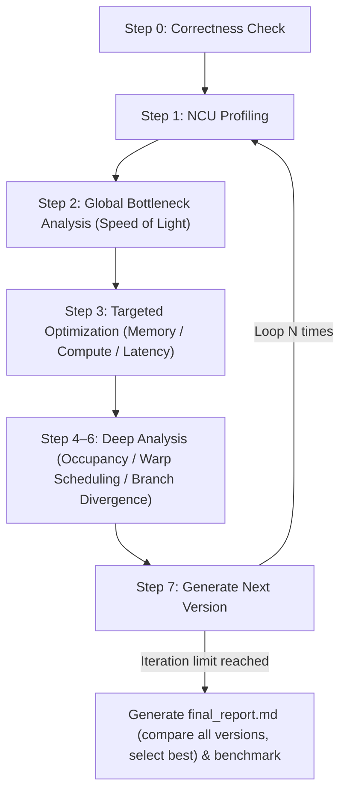

# kernel-opt-skill

A CUDA kernel optimization skill that systematically profiles, identifies bottlenecks, and iteratively improves kernel performance.

[中文文档](README-zh.md)

## Requirements

| Dependency | Version |
| --- | --- |
| NVIDIA GPU | Compute Capability 7.0+ (Volta and above) |
| CUDA Toolkit | 11.6+ (12.6+ recommended) |
| Nsight Compute | 2024.3.2+ |
| Python | 3.10+ |
| PyTorch | 2.0+ |
| nsight-python | 0.9.6+ |

## Project Structure

```text
kernel-opt-skill/
├── skills/kernel-opt-skill/
│   ├── SKILL.md                  # Entry point, defines the optimization loop
│   ├── env/                      # Environment check & GPU configuration
│   ├── profiling/                # NCU profiling & correctness verification
│   ├── benchmark/                # Solution vs reference framework comparison
│   ├── cuda/                     # Memory / compute / latency optimization references
│   └── report/                   # Report generation templates
└── demo/                         # Optimization case studies (softmax, gemm, ...)
```

## Quick Start

Invoke the skill with your kernel file, iteration count, and output directory:

```text
/kernel-opt-skill Please optimize this kernel <kernel.cu>, run 3 iterations, output to <output_dir>
```

The optimization loop runs automatically:



### Output Structure

```text
<output_dir>/
├── ref.py                  # Reference implementation
├── env_check.md            # Environment info
├── v0/
│   ├── v0.cu               # Source code
│   ├── correctness.md      # Correctness verification result
│   ├── ncu_summary.md      # NCU metrics summary (LLM-friendly)
│   └── ncu_details.md      # Full NCU metrics table
├── v1/ v2/ v3/ ...         # Subsequent iterations (same structure)
├── final_report.md         # Final optimization comparison report
└── benchmark.md            # Best version vs reference performance comparison
```

## Demo

Full optimization walkthroughs with source code, per-version NCU profiles, and benchmark results are in [demo/DEMO.md](demo/DEMO.md).

| Case | Shape | Best Speedup | vs PyTorch |
| --- | --- | --- | --- |
| [Softmax](demo/DEMO.md#1-softmax) | N=10240, D=1024 | **6.32×** | 1.85× faster |
| [GEMM](demo/DEMO.md#2-gemm) | M=K=N=4096 | **6.81×** | 1.52× slower than cuBLAS |
| [MHA](demo/DEMO.md#3-mha) | N=1024, d=512, h=8 | **10.23×** | 2.86× slower than Flash Attention |
