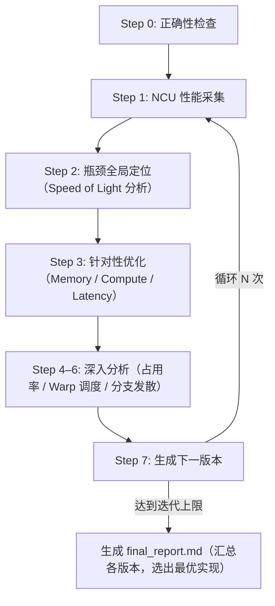

# kernel-opt-skill

面向 CUDA 的 kernel 优化 Skill，通过系统化的性能分析、瓶颈定位和迭代优化，帮助开发者快速提升 CUDA kernel 性能。

## 功能特性

- **环境自动检测**：验证 GPU 型号、CUDA/nvcc 版本、NCU、PyTorch 及驱动配置
- **正确性验证**：编译 CUDA kernel 并与 Python 参考实现对比，确保优化前后输出一致
- **NCU 深度 Profiling**：基于 nsight-python API 采集 100+ 关键性能指标，生成 LLM 友好的分析报告
- **智能瓶颈定位**：自动识别并分类 Memory-Bound / Compute-Bound / Latency-Bound 三类瓶颈
- **策略化优化指导**：针对不同瓶颈类型，提供按优先级排序的优化建议
- **迭代优化循环**：执行多轮自动化优化，并生成各版本性能对比的最终报告

## 环境要求

| 依赖项 | 版本要求 |
| --- | --- |
| NVIDIA GPU | Compute Capability 7.0+（Volta 及以上） |
| CUDA Toolkit | 11.6+（推荐 12.6+） |
| Nsight Compute | 2024.3.2+ |
| Python | 3.10+ |
| PyTorch | 2.0+ |
| nsight-python | 0.9.6+ |

## 项目结构

```text
kernel-opt-skill/
├── skills/kernel-opt-skill/          # 技能实现
│   ├── SKILL.md                      # 主技能入口
│   ├── env/
│   │   ├── SKILL.md                  # 环境检查技能定义
│   │   └── scripts/
│   │       ├── env_check.py          # 环境检查脚本
│   │       └── enc_config.py         # GPU 时钟锁定脚本
│   ├── profiling/
│   │   ├── SKILL.md                  # 性能分析技能定义
│   │   ├── reference/NCU.md          # NCU 指标参考文档
│   │   └── script/
│   │       ├── correctness_check.py  # 正确性验证脚本
│   │       └── ncu_profile.py        # NCU profiling 脚本
│   ├── cuda/
│   │   ├── SKILL.md                  # 优化策略技能定义
│   │   └── reference/
│   │       ├── memory-opt.md         # 内存瓶颈优化策略
│   │       ├── compute-opt.md        # 计算瓶颈优化策略
│   │       └── latency-opt.md        # 延迟瓶颈优化策略
│   └── report/
│       ├── SKILL.md                  # 报告生成技能定义
│       └── prompt/report.md          # 报告提示词模板
└── demo/softmax/                     # Softmax 优化完整案例
    ├── env_check.md
    ├── final_report.md
    ├── ref.py
    └── v0/ v1/ v2/ v3/               # 各版本迭代
```

## 快速开始

调用 Skill，指定待优化的 kernel 文件、迭代次数和输出目录：

```text
/kernel-opt-skill 请帮我优化这个 kernel <kernel.cu>，迭代三次，输出到 <output_dir> 目录
```

触发后，将按以下步骤自动执行优化循环：



### 输出目录结构

```text
<output_dir>/
├── ref.py                  # 参考实现
├── env_check.md            # 环境信息
├── v0/
│   ├── v0.cu               # 源码
│   ├── correctness.md      # 正确性验证结果
│   ├── ncu_summary.md      # NCU 指标摘要（LLM 友好格式）
│   └── ncu_details.md      # NCU 完整指标表格
├── v1/ v2/ v3/ ...         # 各迭代版本（结构同上）
└── final_report.md         # 最终优化对比报告
```

## 实战案例：Softmax 优化

参见 [demo/softmax/](demo/softmax/) 目录，完整记录了从基线到最优版本的 4 轮迭代过程。

| 版本 | 执行时间 | 加速比 | 瓶颈类型 | 关键优化 |
| --- | --- | --- | --- | --- |
| v0（基线） | 869,184 ns | 1.00× | Latency-Bound | 朴素实现（1 thread/行） |
| v1 | 127,680 ns | **6.81×** | Memory-Bound | 1 block/行 + Warp Shuffle |
| v2 | **123,648 ns** | **7.03×** | Memory-Bound | Shared Memory + float4 向量化 |
| v3 | 135,424 ns | 6.42× | Memory-Bound | Online Softmax（寄存器压力增大，性能下降） |

**v2 关键改进：**

- Block 分配策略从 1 thread/行改为 1 block/行，线程占用率从 16.6% 提升至 97.5%
- 全局内存访问效率从 12.5% 提升至 100%（合并访问 + float4 向量化）
- Shared Memory 缓存整行数据，消除重复的 L1 缓存访问
- 使用 Warp Shuffle 协作规约，降低同步开销
