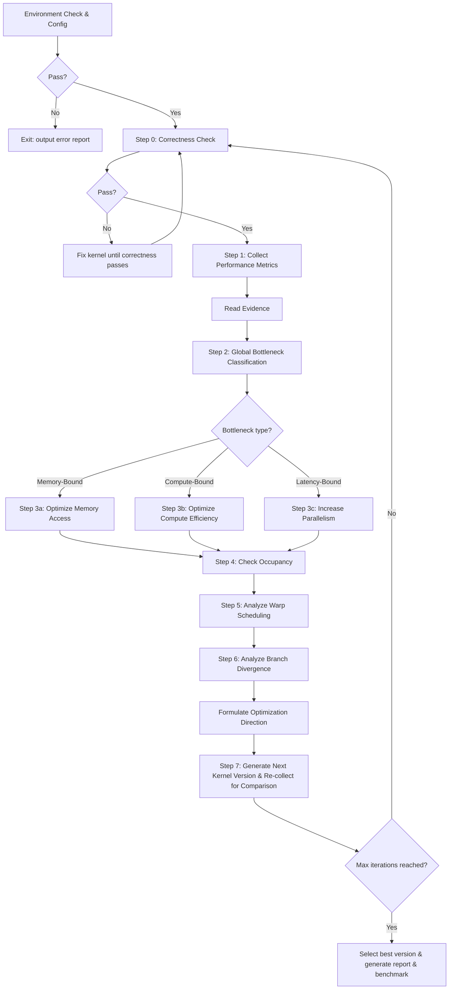

# kernel-opt-skill

## Optimization Flow



---

## Sub-skill Routing

| Sub-skill | Location | Responsibility |
|---|---|---|
| env | `env/ENV.md` | Required environment check (including Triton) + env configuration |
| profiling | `profiling/PROFILING.md` | Correctness check + NCU collection + metric interpretation + bottleneck classification |
| benchmark | `benchmark/BENCHMARK.md` | Lateral comparison of solution vs. reference framework (execution time + hardware metrics) |
| cuda | `cuda/CUDA.md` | CUDA optimization strategies |
| triton | `triton/TRITON.md` | Triton optimization strategies |
| report | `report/REPORT.md` | Generate optimization flow report |

---

## Optimization Loop

**All intermediate artifacts and kernel iterations are saved to `<output_dir>`. If not specified, defaults to the current directory `<./>`.**

**Default maximum iterations: `N=3`, user-configurable.**

Once the maximum iteration count `N` is set, it cannot be changed. `N+1` subdirectories are created under `<output_dir>`, each representing a different version:

```text
<output_dir>/
├── ref.py
├── env_check.md
├── v0/
│   ├── correctness.md
│   ├── ncu_summary.md
│   ├── ncu_details.md
│   └── v0.cu
├── v1/
│   ├── correctness.md
│   ├── ncu_summary.md
│   ├── ncu_details.md
│   └── v1.cu
├── v2/
│   ├── correctness.md
│   ├── ncu_summary.md
│   ├── ncu_details.md
│   └── v2.cu
├── v3/
│   ├── correctness.md
│   ├── ncu_summary.md
│   ├── ncu_details.md
│   └── v3.cu
├── final_report.md
└── benchmark.md
```

`v0` is the initial unoptimized version; `v1`, `v2`, `v3` are successive optimization iterations.

### Environment Check & Configuration (env-skill)

* Environment check is a required step — **exit immediately on failure** and output problem details.
* Outputs `<output_dir>/env_check.md`, recording the environment baseline for CUDA/Triton kernel optimization. All subsequent environment queries use this file.

### Step 0: Correctness Check (profiling-skill)

* `ref.py` is the reference for correctness validation, typically a PyTorch implementation.
* Outputs `<output_dir>/v{n}/correctness.md`.
* If correctness check fails, inspect and fix the source code before proceeding.

### Step 1: Performance Metric Collection (profiling-skill)

* Outputs `<output_dir>/v{n}/ncu_summary.md` and `<output_dir>/v{n}/ncu_details.md`, which record all metrics and serve as the basis for subsequent CUDA/Triton optimization decisions.

### Step 2: Global Bottleneck Classification (profiling-skill & cuda-skill)

* Classifies as `Memory-Bound`, `Compute-Bound`, or `Latency-Bound` based on NCU metrics, driving the next optimization direction for both CUDA and Triton implementations. See `profiling/PROFILING.md` for details.

### Step 4: Check Occupancy / Step 5: Analyze Warp Scheduling / Step 6: Analyze Branch Divergence (profiling-skill & cuda-skill)

* Determines optimization strategies based on NCU-collected `occupancy`, `warp scheduling`, and `branch divergence` metrics.

### Step 7: Generate Next Kernel Version & Re-collect for Comparison

* Creates subdirectory `<output_dir>/v{n}`, generates the next kernel version in this directory, and re-collects metrics for comparison.

### Select Best Version & Generate Report (report-skill) & Benchmark (benchmark-skill)

* **When max iterations are reached, stop optimization and output `<output_dir>/final_report.md`.**
* Compare the **best version** against the **reference implementation (PyTorch/CUTLASS)** and output `<output_dir>/benchmark.md`.

---

## Architecture Quick Reference

| Feature | CC 7.x Volta/Turing | CC 8.x Ampere | CC 9.0 Hopper |
|---|---|---|---|
| Tensor Core | Gen 1/2 | Gen 3 | Gen 4 (FP8) |
| Shared Memory limit | 96 KB | 164 KB | 228 KB |
| L2 Cache | 6 MB | 40–80 MB | 50 MB |
| `cp.async` | ✗/Limited | ✓ | ✓ + TMA |
| L2 Persistence | ✗ | ✓ | ✓ |
| Thread Block Cluster | ✗ | ✗ | ✓ |
