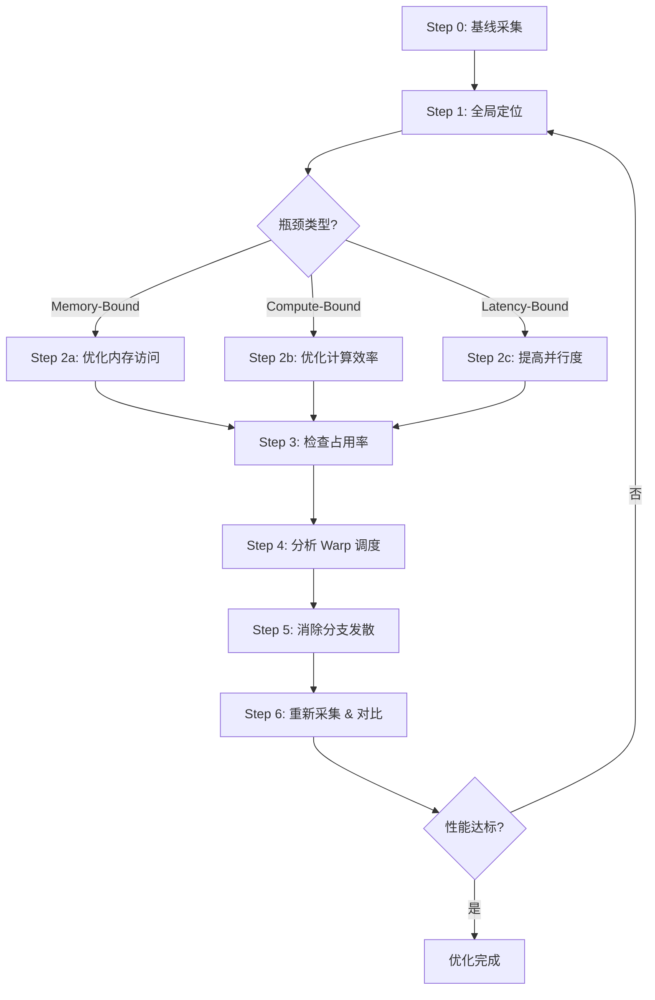

# kernel-opter-skill

## 环境检查

```bash
nvcc --version 2>&1 | grep "release" || echo "❌ nvcc 未找到"
nvidia-smi --query-gpu=name,compute_cap,memory.total,clocks.max.sm,clocks.max.mem \
    --format=csv,noheader 2>&1 || echo "❌ nvidia-smi 未找到"
ncu --version 2>&1 | head -1 || echo "❌ ncu 未找到"
python3 - <<'EOF'
import sys
try:
    import torch
    print(f"✅ PyTorch {torch.__version__}  CUDA available={torch.cuda.is_available()}")
    if torch.cuda.is_available():
        print(f"   GPU: {torch.cuda.get_device_name(0)}  "
              f"compute_cap={torch.cuda.get_device_capability(0)}")
except ImportError:
    print("❌ PyTorch 未找到")
    sys.exit(1)
EOF
```

任意一项不通过，**立即停止**，先修环境。

---

## 6 步优化流程



---

## Sub-skill 路由

| Sub-skill | 职责 |
|---|---|
| `profiling/SKILL.md` | 测量（benchmark + NCU 采集）+ 解读（指标分析 + 瓶颈定位） |
| `cuda/SKILL.md` | 优化（按瓶颈类型给出实施策略） |
| `opt-loop/SKILL.md` | 自动化多轮迭代 + 策略记忆 + best 选择 |
| `report/SKILL.md` | 生成优化流程报告，将 Step 0–6 各环节决策结构化输出 |

---

## 架构速查

| 特性 | CC 7.x Volta/Turing | CC 8.x Ampere | CC 9.0 Hopper |
|---|---|---|---|
| Tensor Core | 第1/2代 | 第3代 | 第4代（FP8） |
| Shared Memory 上限 | 96 KB | 164 KB | 228 KB |
| L2 缓存 | 6 MB | 40–80 MB | 50 MB |
| `cp.async` | ✗/有限 | ✓ | ✓ + TMA |
| L2 Persistence | ✗ | ✓ | ✓ |
| Thread Block Cluster | ✗ | ✗ | ✓ |
