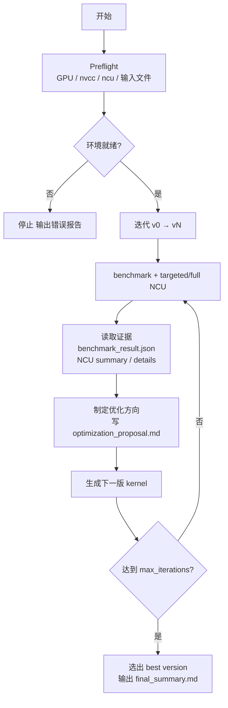
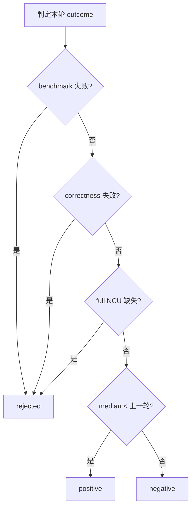

# Operator Optimization Loop

## Inputs

| 参数 | 必须 | 说明 |
|---|---|---|
| `kernel.cu` | ✓ | 需暴露 `extern "C" void solve(...)` |
| `--max-iterations=N` | ✓ | 未提供时停止并要求用户给出 |
| `--ref=<ref.py>` | 强烈建议 | 缺少则无法宣称 correctness 已验证 |
| `--M/--N/...` | 视签名 | kernel 整型维度参数 |
| `--warmup` / `--repeat` | — | 默认 10 / 20 |
| `--run-dir` | — | 指定输出目录 |
| `--resume-from=best\|source\|explicit` | — | 默认 `best` |
| `--arch` / `--gpu` / `--seed` / `--ptr-size` | — | 同 benchmark.py |
| `--nvcc-bin` / `--ncu-bin` | — | 工具路径 |

---

## Workflow



---

## Strategy Memory

两级记忆：当前 run（`run_manifest.json`）+ 全局（`strategy-memory/global_strategy_memory.json`）。

`optimization_proposal.md` 必须包含 `## Strategy tags` 节。



- `blocked`：跳过 rejected 策略指纹，避免重复踩坑
- `preferred`：优先融合 positive 策略指纹

---

## Outputs

**Run 级**：`run_manifest.json` · `final_summary.md` · `preflight_check.md/json` · `iter_v0/` …

**Iter 级**：`<kernel>.cu` · `benchmark_result.json` · `benchmark.stdout/stderr.txt` · `iteration_summary.md` · `optimization_proposal.md` · `targeted.ncu-rep` + `targeted_summary/details.txt` · `full.ncu-rep` + `full_summary/details.txt`

**Final response 必须包含**：最佳版本路径 · baseline vs best 对比 · best full NCU 路径 · 主瓶颈与关键优化思路 · 淘汰版本及原因 · 策略记忆结论（positive/negative/rejected） · blocked/preferred 执行情况

---

## Failure Handling

- correctness 失败 → 标记 rejected，不参与 best 排名
- profiling 不可用或 full 缺失 → 明确原因，停止
- benchmark / 环境失败 → 输出失败证据，不得静默跳过

**提前停止条件**：语义错误需先修正确性 · `ncu` 无法运行 · 连续多轮无可解释性能改善 · 达到用户目标或收益明显递减

---

## Examples

```bash
# 基础用法
python skills/kernel-opter-skill/opt-loop/scripts/opt-loop.py <kernel.cu> \
    --max-iterations=N --ref=<ref.py> --M=1024 --N=1024 --warmup=10 --repeat=20

# 继续已有 run-dir
python skills/kernel-opter-skill/opt-loop/scripts/opt-loop.py <next.cu> \
    --run-dir=<existing_dir> --resume-from=best --max-iterations=N \
    --ref=<ref.py> --M=1024 --N=1024

# 仅做 preflight 检查
python skills/kernel-opter-skill/opt-loop/scripts/opt-loop.py <kernel.cu> \
    --max-iterations=N --preflight-only
```
